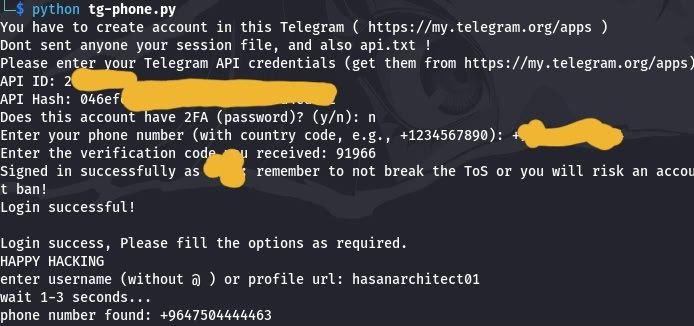

# Telegram-phone-number-finder
This python script is using for finding phone number of user without any brute-force phone number or any other ways, The require is only the username of account, or URL of profile, and The phone number will automatically display on the screen.

# PIP's
    pip install telethon==1.34.0
    pip install python-telegram-bot==20.3

# Before starting, you'll need:

 Python 3.6 or later installed,
 A Telegram account,
 Basic knowledge of command line operations.

## Step 1: Get Your Telegram API Credentials

    Go to https://my.telegram.org/apps

    Log in with your Telegram account (use your phone number with country code)

    Fill out the form with:

        App title: Your app name (e.g., "MyTestApp")

        Short name: A short identifier (e.g., "mytest")

        Platform: Desktop

        Description: Brief description of your app

    Click "Create application"

    You'll see your API ID and API Hash - save these securely

# ⚠️ Warning: Never share your API credentials with anyone!

### Example Screenshots

  
   
  

# Final Notes

  ### This script is for educational purposes only

  ### Respect Telegram's Terms of Service

  ### Don't use this for spamming or malicious activities

  ### The script stores your session locally - keep it secure
